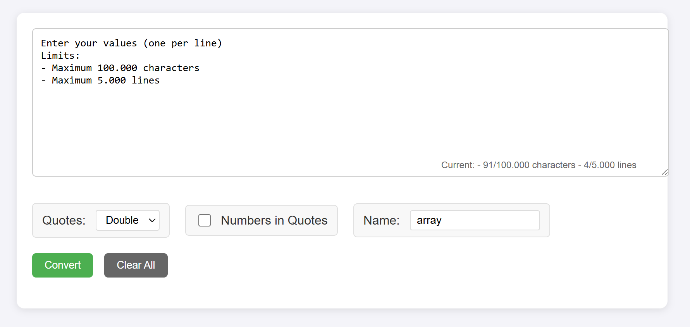

# ArrayThisClone

## Disclaimer
This is my own copy of arraythis by `https://populu.com/`.
Sadly, the original page is currently compromised and since I use the tool almost daily I just wanted to create my own replication.
I informed the owner of the original page about the compromise but have not heard back.

## Into
A lightweight, secure web tool for converting line-separated values into array declarations for various programming languages.



## Features

- Convert line-separated values into array declarations for:
  - JavaScript (`var arrayName = [...]`)
  - Python (`arrayName = [...]`)
  - PHP (`$arrayName = [...]`)
  - Perl (`@arrayName = (...)`)
  - Raw array format
- Customizable array name for each declaration
- Customizable quote styles (single or double quotes)
- Option to quote numeric values
- One-click copying for each format
- Secure input handling and XSS prevention
- Mobile-friendly responsive design

## Usage

1. Enter your values in the text area, one per line
2. Select quote style (single or double quotes)
3. Choose whether to quote numeric values
4. Optionally customize the array name (defaults to "array")
5. Click "Convert" to generate array declarations
6. Use the "Copy" button next to each format to copy to clipboard

### Example Input
```
value1
value2
123
"quoted value"
```

### Example Default Output

#### JavaScript
```javascript
var array = ["value1", "value2", 123, "quoted value"];
```

#### Python
```python
list_name = ["value1", "value2", 123, "quoted value"]
```

#### PHP
```php
$array = ["value1", "value2", 123, "quoted value"];
```

#### Perl
```perl
@array = ("value1", "value2", 123, "quoted value");
```

## Limits and Safety Features

- Maximum 100,000 characters input
- Maximum 5,000 lines
- HTML sanitization for XSS prevention
- Input validation and sanitization
- Safe DOM manipulation
- Warning for large datasets
- Array name sanitization (removes invalid characters)

## Technical Details

- Pure vanilla JavaScript (no dependencies)
- Uses modern browser APIs (Clipboard API)
- Mobile-responsive CSS
- Cross-browser compatible

## Local Development

1. Clone the repository:
```bash
git clone https://github.com/Gi7w0rm/ArrayThisClone.git
```

2. Open `index.html` in your browser

No build process or dependencies required!

## Security

ArrayThis implements several security measures:

- HTML sanitization to prevent XSS attacks
- Input length limiting to prevent DoS attacks
- Safe DOM manipulation (no innerHTML usage)
- Proper event handling and error management

## Browser Compatibility

Tested and working in:
- Chrome (latest)
- Firefox (latest)
- Safari (latest)
- Edge (latest)

## License

MIT License - feel free to use and modify as needed.

## Credits

Inspired by the original ArrayThis tool (currently compromised). Built as a secure, modern alternative.

## Contributing

1. Fork the repository
2. Create your feature branch
3. Commit your changes
4. Push to the branch
5. Create a new Pull Request
